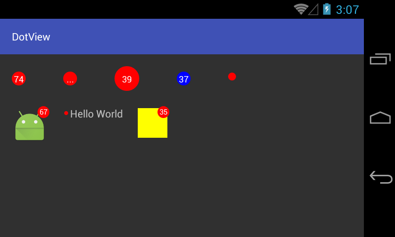

# DotView

未读消息提示，可自定义颜色及Padding
> 在程序中随处可见红点提示，用于提示用户有数据更新或新功能。遵循不重复造轮子的原则，我们将这一部分独立出来，以备复用。

### 效果展示
> 在大部分情况下红点提示会显示在图标右上角，也有部分是在文字的前面。



### 使用
#### DotView
> 我们可以使用DotView，在任何你需要的地方。

1. xml布局
```xml
<me.codego.view.DotView
    android:layout_width="wrap_content"
    android:layout_height="wrap_content"
    android:text="37"
    android:textColor="#FFF"
    android:textSize="12sp"
    app:dotPadding="3dp" 
    app:dotColor="#00F"/>
```

#### DotLayout
> 我们也可以直接使用DotLayout，DotLayout集成更简单。

1. 我们可以使用DotLayout包裹任何需要提示
```xml
<me.codego.view.DotLayout
    android:layout_width="wrap_content"
    android:layout_height="wrap_content"
    app:dotOverPadding="3dp">

    <ImageView
        android:layout_width="wrap_content"
        android:layout_height="wrap_content"
        android:src="@mipmap/ic_launcher"/>
</me.codego.view.DotLayout>
```
2. 调用`dotLayout.show(true, 4)`进行展示
