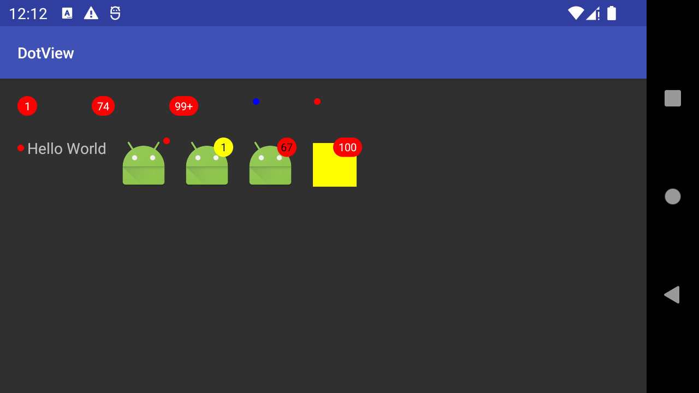

# DotView

未读消息提示，可自定义颜色及Padding
> 在程序中随处可见红点提示，用于提示用户有数据更新或新功能。遵循不重复造轮子的原则，我们将这一部分独立出来，以备复用。

### 效果展示
> 在大部分情况下红点提示会显示在图标右上角，也有部分是在文字的前面。



### 使用
#### 引用
```groovy
# project build.gradle
allprojects {
    repositories {
        ...
        maven { url 'https://jitpack.io' }
    }
}

# module build.gralde
dependencies {
    ...
    implementation 'com.github.mengxn:dotview:2.0.4' // 不向下兼容1.X.X
}
```

#### DotView
> 我们可以使用DotView，在任何你需要的地方。

1. xml布局
```xml
<me.codego.view.DotView
    android:layout_width="wrap_content"
    android:layout_height="wrap_content"
    android:text="37"
    android:textColor="#FFF"
    android:textSize="12sp"
    app:dotRadius="3dp" 
    app:dotColor="#00F"/>
```
dotColor：圆点背景色  
dotRadius：圆点半径值  

#### DotLayout
> 我们也可以直接使用DotLayout，DotLayout集成更简单。

1. 我们可以使用 DotLayout 包裹任何需要提示的 View，例如：
```xml
<me.codego.view.DotLayout
    android:layout_width="wrap_content"
    android:layout_height="wrap_content"
    app:dotMarginEnd="-5dp"
    app:dotMarginTop="-5dp"
    app:dotPaddingHorizontal="5dp"
    app:dotPaddingVertical="3dp"
    app:dotRadius="3dp"
    app:dotColor="#f00"
    app:dotTextColor="#FFF"
    app:dotTextSize="10sp"
    app:dotType="plus" >

    <ImageView
        android:layout_width="wrap_content"
        android:layout_height="wrap_content"
        android:src="@mipmap/ic_launcher"/>
</me.codego.view.DotLayout>
```
dotColor：圆点背景色  
dotTextColor：圆点前景色，即数字显示颜色  
dotTextSize：字号大小  
dotRadius：圆点半径值  
dotPaddingHorizontal：圆点前后padding  
dotPaddingVertical：圆点上下padding
dotMarginTop: 圆点上margin值
dotMarginEnd: 圆点右margin值
dotLocation：圆点位置：left：左侧；right：右侧
dotType: 圆点数字超限显示方式: normal:不限制；ellipsis：省略号形式；plus：99+形式

2. 调用代码进行展示
- 仅显示提示  
`dotLayout.show(true)`
- 显示数字提示  
`dotLayout.show(true, 4)`
